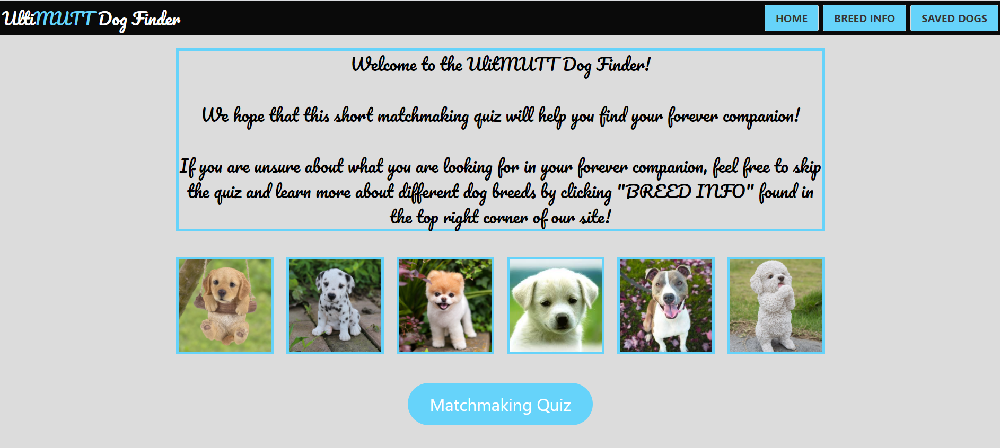
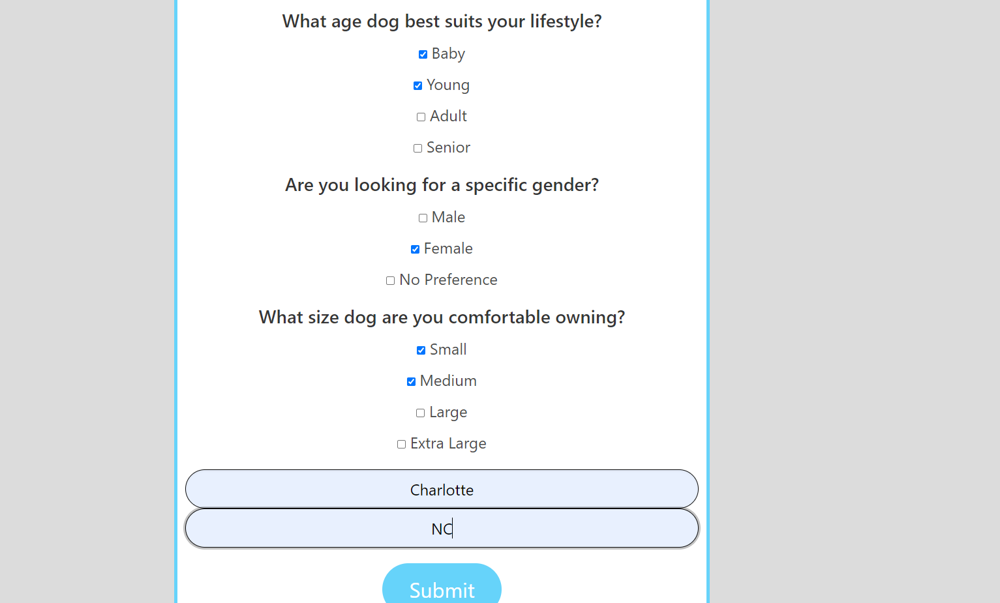
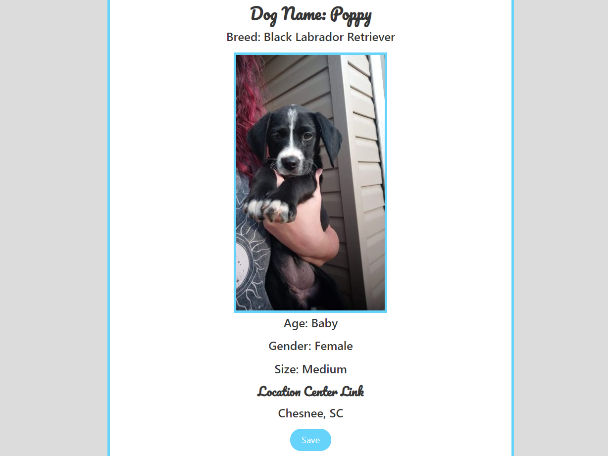
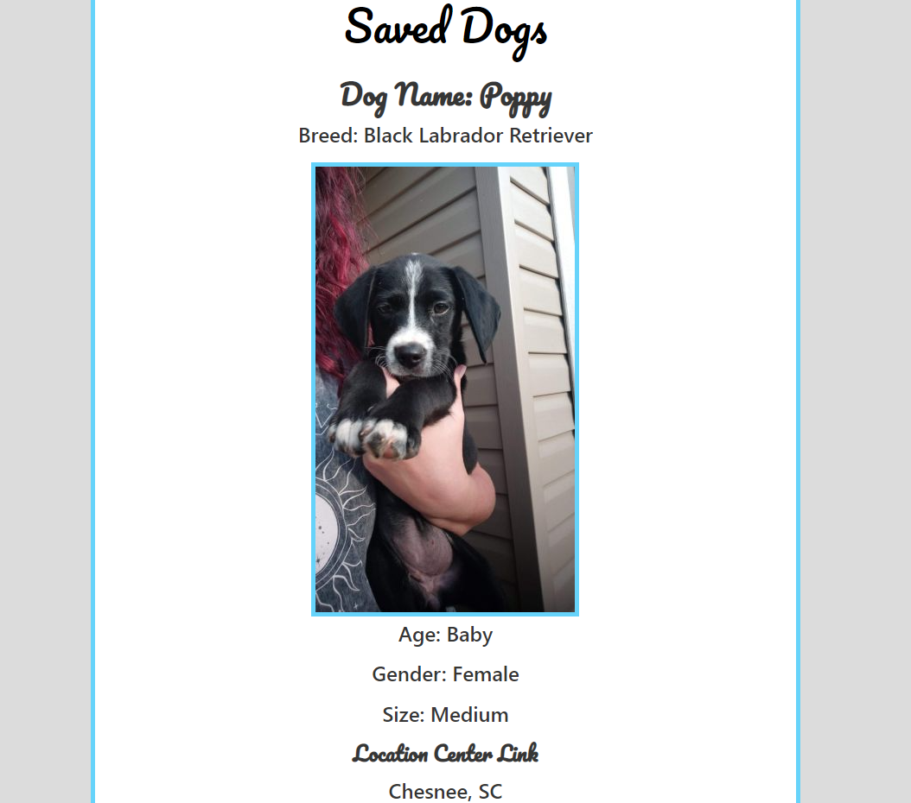
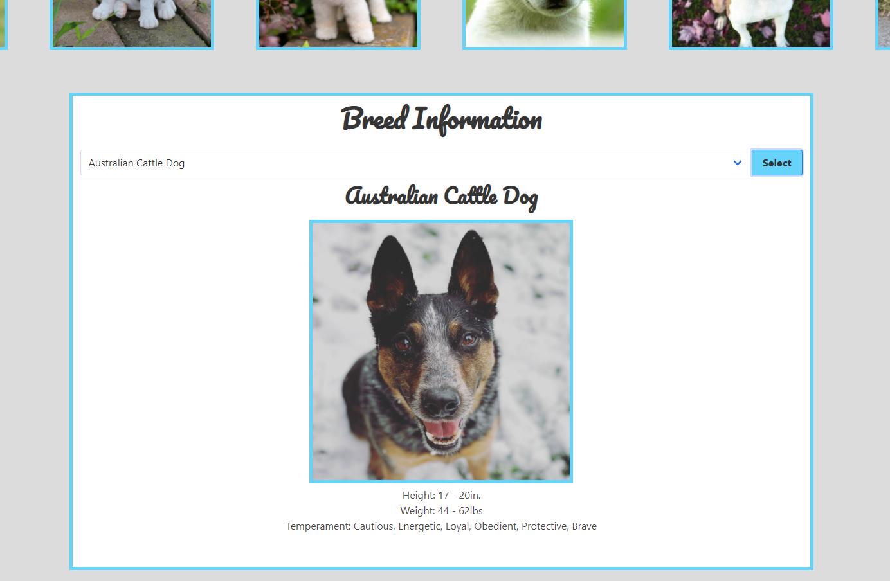

# UltiMutt Dog Finder
    This project emphasizes the use of API's, Bulma, and incorporates local storage to retrieve, style, and store data.

# Main Function
This application was created for people in search of an adoptable dog companion. A site where they can find dogs that meet their criteria at adoption centers near them as well as inform on specific dog breeds and a link on where to adopt the dog of their choosing.

## **Homepage**
* Once the user has opened the homepage they are presented with a welcome message as well as a startquiz option which launches after the button is clicked.

## **Matchmacking Quiz**
* The user is prompt with a series of questions involving dog search criteria as well as input boxes for city and state.

## **Results**
* Once submit button is clicked the user is presnted with 5 adoptable dogs meeting their search criteria.
* Results will print their name, breed, age, gender, location, a link to adopt the dog, as well as a photo of the dog if available.

## **Saving Dogs**
* Once the user sees a dog that they like they can press the save button to save that dog's info onto the saved dogs page.

## **Breed Info**
* The user also has the option to search a specific dog breed in the Breed Info page.
* Once the user presses search a picture, average height, average weight, as well as tempermant will be displayed for the user.

## Key Features
* This site uses checkboxes that take in the values of the marked items and stores them into arrays. The arrays are then used to create
query parameters for the API.

* Ajax calls are use to call and get information from the API's.

* Template literals are utilized to dynamical populate information from API onto the results page.

* Ajax calls are use to call and get information from the API's.

* Using on click functions for the save buttons information is stored into local storage and then retrieved and displayed on the saved dogs page.

* A drop down menu is utilized in the breed search to ensure proper breed names are input into the search bar.

## Link
* Link to deployed application on github pages
[UltiMUTT Dog Finder](https://marenhamby.github.io/UltiMutt_dog_finder/)

* Link to the presentation
[UltiMUTT Dog Finder Presentation](https://docs.google.com/presentation/d/1mDzgubVdcHaLeKHzT-n3kHVwF0kYBEb4gNx2jVvCjAo/edit?usp=sharing)

